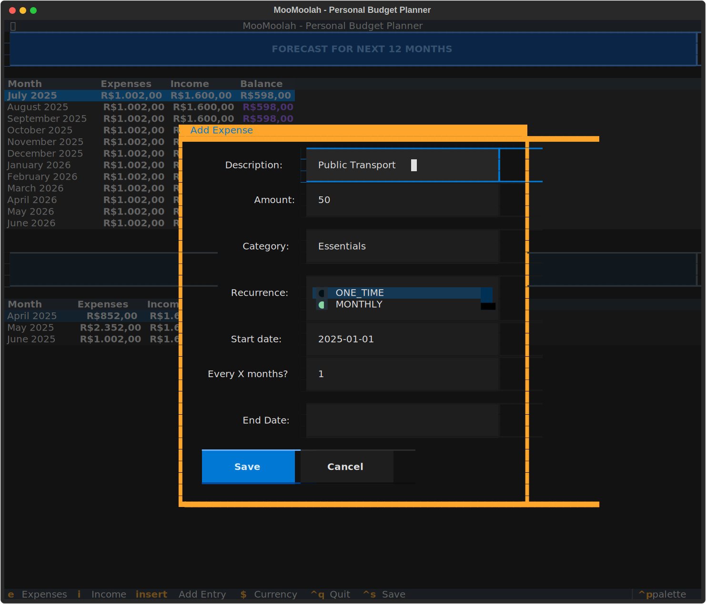

# MooMoolah

A terminal-based personal budget planning application built with Python and Textual.

Your data is stored locally in a JSON file, keeping your financial information
private and accessible offline.

## Installation

Install MooMoolah using pip:

```bash
pip install moomoolah
```

## Why?

I wanted a simple way to manage my monthly budget, and I got tired of trying to
bend Google Sheets to do what I needed.

So I decided to build my own, in the terminal, as that's how I like my computing.

Local, private and dead simple.

## Features

- **12-month forecast view** - Shows projected expenses, income, and balance
  for the next 12 months
- **Expense and Income management** - Add, edit, and delete expense/income
  entries
- **Recurring entries** - Support for one-time, monthly, and yearly recurring
  transactions


## Screenshots

Main screen:

[](./demo_main_screen.svg)

Adding an expense:

[](./demo_add_expense.svg)

## Usage

Run the application with an optional state file:

```bash
moomoolah [state_file.json]
```

If no state file is provided, MooMoolah will use a default location following the XDG Base Directory specification:
- `$XDG_DATA_HOME/moomoolah/state.json` (if `XDG_DATA_HOME` is set)
- `~/.local/share/moomoolah/state.json` (default on Linux/Unix)

The state file will be created if it doesn't exist. State files are stored with restricted permissions (600) for security.

## Usage

### Navigation
- **Main screen**: `e` (manage expenses), `i` (manage income)
- **Entry screens**: `Insert` (add entry), `Delete` (remove entry), click row to edit
- **Global shortcuts**: `Ctrl+S` (save), `Ctrl+Q` (quit), `Escape`/`Backspace` (back)

### Entry Management

Each entry includes:

- Description and amount
- Category for organization
- Recurrence type (once, monthly, yearly)
- Start date and optional end date
- Frequency interval (e.g., every 2 months)

## Development

See [plan.md](plan.md) for current development roadmap and planned features.

This project uses [uv](https://docs.astral.sh/uv/) for dependency management.

### Setup

1. Install uv if you haven't already:
   ```bash
   curl -LsSf https://astral.sh/uv/install.sh | sh
   ```

2. Install dependencies:
   ```bash
   uv sync
   ```

3. Run the application:
   ```bash
   # With default state file location
   uv run moomoolah

   # Or with a specific state file
   uv run moomoolah <state_file.json>
   ```

### Running Tests
```bash
uv run pytest
```
